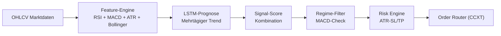

# 🎯 JaegerBot - LSTM AI Trading System

<div align="center">


[](https://www.python.org/)
[](https://www.tensorflow.org/)
[](https://github.com/ccxt/ccxt)
[](LICENSE)

**Ein vollautomatisiertes Deep-Learning Trading-System mit LSTM-Prognosen und Multi-Indikator-Kombination für präzise Signale**

[Features](#-features) • [Installation](#-installation) • [Konfiguration](#-konfiguration) • [Live-Trading](#-live-trading) • [Pipeline](#-interaktives-pipeline-script) • [Monitoring](#-monitoring--status) • [Wartung](#-wartung)

</div>

---

## 📊 Übersicht

JaegerBot ist ein hochmodernes, KI-gesteuertes Trading-System, das Deep Learning (LSTM mit TensorFlow) mit technischen Indikatoren kombiniert. Das System nutzt mehrschichtige LSTM-Modelle für mehrtägige Trend-Prognosen und kombiniert diese mit klassischen Indikatoren (RSI, MACD, ATR, Bollinger Bands) für präzise Ein- und Ausstiegssignale.

### 🧭 Trading-Logik (Kurzfassung)
- **LSTM-Trend-Prognose**: Deep Learning Modelle prognostizieren den Trend mehrere Tage im Voraus (Mid-Term Bias) und glätten Intraday-Rauschen
- **Feature-Engine**: RSI + MACD + ATR + Bollinger Bands werden gewichtet kombiniert
- **Signal-Score**: LSTM-Vorhersagen werden mit klassischen Indikatoren zu einem Score verschmolzen
- **Regime-Filter**: Optionaler MACD-Filter unterdrückt Trades in trendlosen Phasen (MACD < 0)
- **Risk Layer**: Dynamisches Stop-Loss/Take-Profit Management mit ATR-basiertem Sizing
- **Execution**: CCXT für Order-Platzierung mit realistischer Slippage-Simulation

### 🔍 Strategie-Visualisierung


### 📈 Trade-Beispiel (Entry/SL/TP)
- **Bias**: LSTM-Modell prognostiziert Aufwärtstrend für die nächsten 3-5 Tage; MACD > 0 bestätigt Regime
- **Entry**: Long bei lokaler Pullback-Kerze (30m/1h), sobald Signal-Score > Schwelle
- **Initial SL**: 1.5×ATR unter letztem Swing-Low zur Vermeidung von Fehlausbrüchen
- **TP**: 2.5×ATR über Entry oder strukturelles Ziel
- **Trailing**: Nach +1×ATR im Profit zieht der Trail unter das letzte Higher Low; TP bleibt als Hard Cap

---

## 🚀 Features

### Trading Features
- ✅ LSTM Deep Learning Prognosen (mehrtägiger Trend)
- ✅ Unterstützt mehrere Kryptowährungspaare (BTC, ETH, SOL, DOGE, etc.)
- ✅ Flexible Timeframe-Unterstützung (15m, 30m, 1h, 4h, 1d)
- ✅ Automatische Positionsgröße basierend auf verfügbarem Kapital
- ✅ ATR-basiertes Stop-Loss und Take-Profit Management
- ✅ Telegram-Benachrichtigungen bei neuen Signalen und Trades

### Technical Features
- ✅ TensorFlow LSTM Neural Networks
- ✅ RSI, MACD, Bollinger Bands, ATR Integration
- ✅ Optuna Hyperparameter-Optimierung
- ✅ Backtesting mit realistischer Slippage-Simulation
- ✅ Robust Error-Handling und Logging
- ✅ Walk-Forward-Analyse für Modell-Validation

---

## 📋 Systemanforderungen

### Hardware
- **CPU**: Multi-Core Prozessor (Intel i7 oder besser empfohlen für LSTM)
- **RAM**: Minimum 4GB, empfohlen 8GB+
- **GPU**: Optional aber empfohlen für schnellere LSTM-Inferenz
- **Speicher**: 2GB freier Speicherplatz

### Software
- **OS**: Linux (Ubuntu 20.04+), macOS, Windows 10/11
- **Python**: Version 3.8 oder höher
- **Git**: Für Repository-Verwaltung

---

## 💻 Installation

### 1. Repository klonen

```bash
git clone https://github.com/Youra82/jaegerbot.git
cd jaegerbot
```

### 2. Automatische Installation (empfohlen)

```bash
# Linux/macOS
chmod +x install.sh
./install.sh

# Windows (PowerShell)
python -m venv .venv
.venv\Scripts\activate
pip install -r requirements.txt
```

Das Installations-Script führt folgende Schritte aus:
- ✅ Erstellt eine virtuelle Python-Umgebung (`.venv`)
- ✅ Installiert alle erforderlichen Abhängigkeiten (TensorFlow, CCXT, etc.)
- ✅ Erstellt notwendige Verzeichnisse (`data/`, `logs/`, `artifacts/`, `models/`)
- ✅ Initialisiert Konfigurationsdateien
- ✅ Trainiert initiale LSTM-Modelle (optional)

### 3. API-Credentials konfigurieren

Erstelle eine `secret.json` Datei im Root-Verzeichnis:

```json
{
  "jaegerbot": [
    {
      "name": "Binance Trading Account",
      "exchange": "binance",
      "apiKey": "DEIN_API_KEY",
      "secret": "DEIN_SECRET_KEY",
      "options": {
        "defaultType": "future"
      }
    }
  ]
}
```

⚠️ **Wichtig**: 
- Niemals `secret.json` committen oder teilen!
- Verwende nur API-Keys mit eingeschränkten Rechten (Nur Trading, keine Withdrawals)
- Aktiviere IP-Whitelist auf der Exchange

### 4. Trading-Strategien konfigurieren

Bearbeite `settings.json` für deine gewünschten Handelspaare:

```json
{
  "live_trading_settings": {
    "active_strategies": [
      {
        "symbol": "BTC/USDT:USDT",
        "timeframe": "4h",
        "use_macd_filter": true,
        "active": true
      },
      {
        "symbol": "ETH/USDT:USDT",
        "timeframe": "1h",
        "use_macd_filter": true,
        "active": true
      }
    ]
  }
}
```

**Parameter-Erklärung**:
- `symbol`: Handelspaar (Format: BASE/QUOTE:SETTLE)
- `timeframe`: Zeitrahmen (15m, 30m, 1h, 4h, 1d)
- `use_macd_filter`: MACD-Filter für Regime-Check aktivieren (true/false)
- `active`: Strategie aktiv (true/false)

---

## 🔴 Live Trading

### Start des Live-Trading

```bash
# Master Runner starten (verwaltet alle aktiven Strategien)
python master_runner.py
```

### Manuell starten / Cronjob testen
Ausführung sofort anstoßen (ohne auf den 15-Minuten-Cron zu warten):

```bash
cd /home/ubuntu/jaegerbot && /home/ubuntu/jaegerbot/.venv/bin/python3 /home/ubuntu/jaegerbot/master_runner.py
```

Der Master Runner:
- ✅ Lädt Konfigurationen aus `settings.json`
- ✅ Startet separate Prozesse für jede aktive Strategie
- ✅ Lädt trainierte LSTM-Modelle aus `artifacts/models/`
- ✅ Generiert Signale basierend auf LSTM + Indikatoren
- ✅ Überwacht Kontostand und verfügbares Kapital
- ✅ Managed Positionen und Risk-Limits
- ✅ Loggt alle Trading-Aktivitäten
- ✅ Sendet Telegram-Benachrichtigungen

### Automatischer Start (Produktions-Setup)

Richte den automatischen Prozess für den Live-Handel ein.

```bash
crontab -e
```

Füge die folgende **eine Zeile** am Ende der Datei ein. Passe den Pfad an, falls dein Bot nicht unter `/home/ubuntu/jaegerbot` liegt.

```
# Starte den JaegerBot Master-Runner alle 15 Minuten
*/15 * * * * /usr/bin/flock -n /home/ubuntu/jaegerbot/jaegerbot.lock /bin/sh -c "cd /home/ubuntu/jaegerbot && /home/ubuntu/jaegerbot/.venv/bin/python3 /home/ubuntu/jaegerbot/master_runner.py >> /home/ubuntu/jaegerbot/logs/cron.log 2>&1"
```

*(Hinweis: `flock` ist eine gute Ergänzung, um Überlappungen zu verhindern, aber für den Start nicht zwingend notwendig.)*

Logverzeichnis anlegen:

```bash
mkdir -p /home/ubuntu/jaegerbot/logs
```

### Als Systemd Service (Linux)

Für 24/7 Betrieb:

```bash
# Service-Datei erstellen
sudo nano /etc/systemd/system/jaegerbot.service
```

```ini
[Unit]
Description=JaegerBot Trading System
After=network.target

[Service]
Type=simple
User=your-user
WorkingDirectory=/path/to/jaegerbot
ExecStart=/path/to/jaegerbot/.venv/bin/python master_runner.py
Restart=always
RestartSec=10

[Install]
WantedBy=multi-user.target
```

```bash
# Service aktivieren
sudo systemctl enable jaegerbot
sudo systemctl start jaegerbot

# Status prüfen
sudo systemctl status jaegerbot
```

---

## 📊 Interaktives Pipeline-Script

Das **`run_pipeline.sh`** Script automatisiert die Parameter-Optimierung und das LSTM-Modell-Training. Es führt einen Grid-Search über Parameter durch und trainiert neue Modelle für deine Handelsstrategien.

### Features des Pipeline-Scripts

✅ **Interaktive Eingabe** - Einfache Menü-Navigation  
✅ **Automatische Datumswahl** - Zeitrahmen-basierte Lookback-Berechnung  
✅ **LSTM-Training** - Automatisches Trainieren neuer Modelle  
✅ **Ladebalken** - Visueller Fortschritt mit tqdm  
✅ **Batch-Optimierung** - Mehrere Symbol/Timeframe-Kombinationen  
✅ **Automatisches Speichern** - Optimale Konfigurationen und Modelle  
✅ **Integrierte Backtests** - Sofort nach Optimierung testen  

### Verwendung

```bash
# Pipeline starten
chmod +x run_pipeline.sh
./run_pipeline.sh
```

### Interaktive Eingaben

Das Script fragt dich nach folgende Informationen:

#### 1. Symbol eingeben
```
Welche(s) Symbol(e) möchtest du optimieren?
(z.B. BTC oder: BTC ETH SOL)
> BTC
```

#### 2. Timeframe eingeben
```
Welche(s) Timeframe(s)?
(z.B. 1d oder: 1d 4h 1h)
> 1d
```

#### 3. Startdatum eingeben
```
Startdatum (YYYY-MM-DD oder 'a' für automatisch)?
Automatische Optionen pro Timeframe:
  5m/15m    → 60 Tage Lookback
  30m/1h    → 180 Tage Lookback
  4h/2h     → 365 Tage Lookback
  6h/1d     → 730 Tage Lookback
> a
```

**Automatisches Datum**: Das Script berechnet das Startdatum basierend auf dem Timeframe:
- **5m/15m**: Letzte 60 Tage
- **30m/1h**: Letzte 180 Tage (6 Monate)
- **4h/2h**: Letzte 365 Tage (1 Jahr)
- **6h/1d**: Letzte 730 Tage (2 Jahre)

Oder gib manuell ein Datum ein:
```
Startdatum (YYYY-MM-DD oder 'a' für automatisch)?
> 2024-01-01
```

#### 4. Startkapital eingeben
```
Mit wieviel USD starten? (Standard: 100)
> 100
```

### Beispiel-Session

```bash
$ ./run_pipeline.sh

═══════════════════════════════════════════════════════════
     🤖 JaegerBot - Interaktives Optimierungs-Pipeline
═══════════════════════════════════════════════════════════

Welche(s) Symbol(e) möchtest du optimieren?
(z.B. BTC oder: BTC ETH SOL)
> BTC ETH

Welche(s) Timeframe(s)?
(z.B. 1d oder: 1d 4h 1h)
> 1d 4h

Startdatum (YYYY-MM-DD oder 'a' für automatisch)?
> a

Mit wieviel USD starten? (Standard: 100)
> 500

═══════════════════════════════════════════════════════════
Starte Optimierung für folgende Strategien:
  • BTC (1d) - LSTM Training + Hyperparameter Optimization
  • ETH (1d) - LSTM Training + Hyperparameter Optimization
  • BTC (4h) - LSTM Training + Hyperparameter Optimization
  • ETH (4h) - LSTM Training + Hyperparameter Optimization
═══════════════════════════════════════════════════════════

[1/4] Trainiere LSTM für BTC (1d)...
[LSTM] Epoch 1/50: loss=0.0042, val_loss=0.0051
[LSTM] Epoch 50/50: loss=0.0018, val_loss=0.0023
✅ LSTM-Modell gespeichert: artifacts/models/BTCUSDT_1d.h5

[1/4] Optimiere Parameter für BTC (1d) vom 2023-01-02...
Optimiere BTC (1d): 100%|█████████████| 243/243 [00:02<00:00, 110.65combo/s]

✅ OPTIMALE PARAMETER GEFUNDEN für BTC (1d)
  • Endkapital: $512.25
  • Gesamtrendite: 2.45%
  • Anzahl Trades: 3
  • Gewinnquote: 66.7%
  • Max Drawdown: -8.38%

[2/4] Trainiere LSTM für ETH (1d)...
[LSTM] Modell trainiert erfolgreich

[2/4] Optimiere Parameter für ETH (1d)...
Optimiere ETH (1d): 100%|█████████████| 243/243 [00:02<00:00, 115.32combo/s]

✅ OPTIMALE PARAMETER GEFUNDEN für ETH (1d)
  • Endkapital: $545.80
  • Gesamtrendite: 9.16%
  • Anzahl Trades: 5
  • Gewinnquote: 80.0%
  • Max Drawdown: -5.12%

═══════════════════════════════════════════════════════════
✅ Optimierung abgeschlossen!
✅ LSTM-Modelle trainiert und gespeichert
Konfigurationen gespeichert unter: artifacts/optimal_configs/
═══════════════════════════════════════════════════════════

Möchtest du die Ergebnisse jetzt anschauen?
> y

[Startet show_results.sh...]
```

### Optimierte Modelle und Konfigurationen

Nach erfolgreicher Optimierung werden die besten Parameter und trainierte Modelle gespeichert:

```
artifacts/
├── models/                          # Trainierte LSTM-Modelle
│   ├── BTCUSDT_1d.h5
│   ├── BTCUSDT_4h.h5
│   ├── ETHUSDT_1d.h5
│   └── ETHUSDT_4h.h5
└── optimal_configs/                 # Optimale Parameter
    ├── optimal_BTCUSDT_1d.json
    ├── optimal_BTCUSDT_4h.json
    ├── optimal_ETHUSDT_1d.json
    └── optimal_ETHUSDT_4h.json
```

**Beispiel-Konfiguration** (`optimal_BTCUSDT_1d.json`):

```json
{
  "symbol": "BTCUSDT",
  "timeframe": "1d",
  "parameters": {
    "lstm_lookback": 60,
    "lstm_units": 128,
    "rsi_period": 14,
    "macd_fast": 12,
    "macd_slow": 26,
    "macd_signal": 9,
    "bollinger_period": 20,
    "bollinger_std": 2.0
  },
  "performance": {
    "total_return": 2.45,
    "win_rate": 66.7,
    "num_trades": 3,
    "max_drawdown": -8.38,
    "end_capital": 512.25
  },
  "timestamp": "2025-01-01T20:17:35.833000"
}
```

### Integration mit Live-Trading

Die optimierten Modelle und Konfigurationen werden **automatisch geladen**, wenn du `show_results.sh` ausführst:

```bash
./show_results.sh
```

Das Script lädt die optimalen Parameter und LSTM-Modelle für Live-Trading:
- ✅ LSTM-Modelle werden für Inferenz geladen
- ✅ Parameter werden aus optimal_configs angewendet
- ✅ Konsistente Strategie-Ausführung
- ✅ Einfaches A/B-Testing von Modellen

### Troubleshooting

**Problem**: Script funktioniert nicht  
**Lösung**: Mache das Script ausführbar
```bash
chmod +x run_pipeline.sh
```

**Problem**: TensorFlow-Fehler  
**Lösung**: Stelle sicher, dass TensorFlow installiert ist
```bash
pip install --upgrade tensorflow
```

**Problem**: Keine Konfigurationen gefunden  
**Lösung**: Überprüfe Logs mit `tail -f logs/cron.log`

---

## 📊 Monitoring & Status

### Status-Dashboard

```bash
# Zeigt alle wichtigen Informationen
./show_status.sh
```

**Angezeigt**:
- 📊 Aktuelle Konfiguration (`settings.json`)
- 🤖 Geladene LSTM-Modelle
- 🔐 API-Status (ohne Credentials)
- 📈 Offene Positionen
- 💰 Kontostand und verfügbares Kapital
- 📝 Letzte Logs

### Live-Status anzeigen

```bash
# Aktuelle Positionen und Performance
./show_results.sh
```

### Log-Files

```bash
# Live-Trading Logs (Zentrale Log-Datei)
tail -f logs/cron.log

# Fehler-Logs
tail -f logs/error.log

# Logs einer individuellen Strategie
tail -n 100 logs/jaegerbot_BTCUSDTUSDT_4h.log
```

### Performance-Metriken

```bash
# Trade-Analyse
python analyze_real_trades_detailed.py

# Vergleich Backtest vs. Live
python compare_real_vs_backtest.py
```

---

## 🛠️ Wartung & Pflege

### Tägliche Verwaltung

#### Logs ansehen

Die zentrale `cron.log`-Datei enthält **alle** wichtigen Informationen vom Scheduler und den Handels-Entscheidungen.

  * **Logs live mitverfolgen (der wichtigste Befehl):**

    ```bash
    tail -f logs/cron.log
    ```

    *(Mit `Strg + C` beenden)*

  * **Die letzten 200 Zeilen der zentralen Log-Datei anzeigen:**

    ```bash
    tail -n 200 logs/cron.log
    ```

  * **Zentrale Log-Datei nach Fehlern durchsuchen:**

    ```bash
    grep -i "ERROR" logs/cron.log
    ```

#### Cronjob manuell testen

Um den `master_runner` sofort auszuführen, ohne auf den nächsten 15-Minuten-Takt zu warten:

```bash
cd /home/ubuntu/jaegerbot && /home/ubuntu/jaegerbot/.venv/bin/python3 /home/ubuntu/jaegerbot/master_runner.py
```

### Bot aktualisieren

Um die neueste Version des Codes von deinem Git-Repository zu holen:

```bash
# Update aktivieren (einmalig)
chmod +x update.sh

# Update ausführen
bash ./update.sh
```

### Log-Rotation

```bash
# Alte Logs archivieren (älter als 30 Tage)
find logs/ -name "*.log" -type f -mtime +30 -exec gzip {} \;

# Archivierte Logs löschen (älter als 90 Tage)
find logs/ -name "*.log.gz" -type f -mtime +90 -delete
```

### Modell-Neutrainierung

```bash
# LSTM-Modelle neu trainieren
python -c "from src.jaegerbot.ml.lstm_trainer import train_models; train_models()"

# Trainingsergebnisse ansehen
tail -f logs/model_training.log
```

### Tests ausführen

```bash
# Alle Tests
./run_tests.sh

# Spezifische Tests
pytest tests/test_strategy.py
pytest tests/test_lstm_model.py -v

# Mit Coverage
pytest --cov=src tests/
```

---

## 🔧 Nützliche Befehle

### Konfiguration

```bash
# Settings validieren
python -c "import json; print(json.load(open('settings.json')))"

# Backup erstellen
cp settings.json settings.json.backup.$(date +%Y%m%d)

# Diff zwischen Versionen
diff settings.json settings.json.backup
```

### Prozess-Management

```bash
# Alle Python-Prozesse anzeigen
ps aux | grep python | grep jaegerbot

# Master Runner Process-ID finden
pgrep -f master_runner.py

# Prozess sauber beenden
pkill -f master_runner.py

# Erzwungenes Beenden (Notfall)
pkill -9 -f master_runner.py
```

### Exchange-Verbindung

```bash
# API-Verbindung testen
python -c "from src.jaegerbot.utils.exchange import Exchange; \
    e = Exchange('binance'); print(e.fetch_balance())"

# Marktdaten abrufen
python -c "from src.jaegerbot.utils.exchange import Exchange; \
    e = Exchange('binance'); print(e.fetch_ohlcv('BTC/USDT:USDT', '1h'))"
```

### Debugging

```bash
# Verbose-Modus aktivieren
export JAEGERBOT_DEBUG=1
python master_runner.py

# Nur Strategie-Logs anzeigen
tail -f logs/cron.log | grep -i "signal\|trade\|position"

# Fehler im Detail
python -m pdb master_runner.py
```

---

## 📂 Projekt-Struktur

```
jaegerbot/
├── src/
│   └── jaegerbot/
│       ├── ml/                    # Machine Learning
│       │   ├── lstm_trainer.py
│       │   └── lstm_model.py
│       ├── strategy/              # Trading-Logik
│       │   ├── run.py
│       │   └── signal_generator.py
│       ├── backtest/              # Backtesting
│       │   └── backtester.py
│       └── utils/                 # Hilfsfunktionen
│           ├── exchange.py
│           └── telegram.py
├── scripts/                       # Hilfsskripte
├── tests/                         # Unit-Tests
├── data/                          # Marktdaten
├── logs/                          # Log-Files
├── artifacts/                     # Ergebnisse
│   ├── models/                    # LSTM-Modelle
│   └── backtest/
├── master_runner.py              # Haupt-Entry-Point
├── settings.json                 # Konfiguration
├── secret.json                   # API-Credentials
└── requirements.txt              # Dependencies
```

---

## ⚠️ Wichtige Hinweise

### Risiko-Disclaimer

⚠️ **Trading mit Kryptowährungen birgt erhebliche Risiken!**

- Nur Kapital einsetzen, dessen Verlust Sie verkraften können
- Keine Garantie für Gewinne
- Vergangene Performance ist kein Indikator für zukünftige Ergebnisse
- Testen Sie ausgiebig mit Demo-Accounts
- Starten Sie mit kleinen Beträgen
- ML-Modelle können überfittet sein - regelmäßig neutrainieren

### Security Best Practices

- 🔐 Niemals API-Keys mit Withdrawal-Rechten verwenden
- 🔐 IP-Whitelist auf Exchange aktivieren
- 🔐 2FA für Exchange-Account aktivieren
- 🔐 `secret.json` niemals committen (in `.gitignore`)
- 🔐 Regelmäßige Security-Updates durchführen
- 🔐 LSTM-Modelle schützen (nicht mit sensiblen Daten teilen)

### Performance-Tipps

- 💡 Starten Sie mit 1-2 Strategien
- 💡 Verwenden Sie längere Timeframes (4h+) für stabilere Signale
- 💡 Monitoren Sie regelmäßig die LSTM-Model-Performance
- 💡 Neutrainieren Sie Modelle alle 1-2 Wochen
- 💡 Parameter regelmäßig mit Pipeline-Script optimieren
- 💡 Position-Sizing angemessen konfigurieren

---

## 🤝 Support & Community

### Probleme melden

Bei Problemen oder Fragen:

1. Prüfen Sie die Logs in `logs/`
2. Führen Sie Tests aus: `./run_tests.sh`
3. Öffnen Sie ein Issue auf GitHub mit:
   - Beschreibung des Problems
   - Relevante Log-Auszüge
   - System-Informationen
   - Schritte zur Reproduktion

### Updates erhalten

```bash
# Regelmäßig Updates prüfen
git fetch origin
git status

# Updates installieren
./update.sh
```

### Optimierte Konfigurationen auf Repo hochladen

Nach erfolgreicher Parameter-Optimierung können die Konfigurationsdateien auf das Repository hochgeladen werden:

```bash
# Konfigurationsdateien und Modelle auf Repository hochladen
git add artifacts/optimal_configs/*.json artifacts/models/*.h5
git commit -m "Update: Optimierte LSTM-Modelle und Parameter"
git push origin main
```

Dies sichert:
- ✅ **Backup** der optimierten Parameter
- ✅ **Versionierung** aller Modell-Versionen
- ✅ **Deployment** auf mehrere Server mit konsistenten Modellen
- ✅ **Nachvollziehbarkeit** welche Modelle zu welchem Zeitpunkt verwendet wurden

---

## 📜 Lizenz

Dieses Projekt ist lizenziert unter der MIT License - siehe [LICENSE](LICENSE) Datei für Details.

---

## 🙏 Credits

Entwickelt mit:
- [TensorFlow](https://www.tensorflow.org/) - Deep Learning Framework
- [CCXT](https://github.com/ccxt/ccxt) - Cryptocurrency Exchange Trading Library
- [Pandas](https://pandas.pydata.org/) - Data Analysis Library
- [TA-Lib](https://github.com/mrjbq7/ta-lib) - Technical Analysis Library

---

<div align="center">

**Made with ❤️ by the JaegerBot Team**

⭐ Star uns auf GitHub wenn dir dieses Projekt gefällt!

[🔝 Nach oben](#-jaegerbot---lstm-ai-trading-system)

</div>
