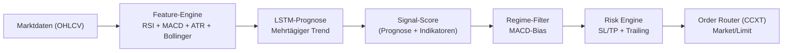

# 🎯 JaegerBot - Advanced AI-Powered Trading System

<div align="center">


[](https://www.python.org/)
[](https://www.tensorflow.org/)
[](https://github.com/ccxt/ccxt)
[](LICENSE)

**Ein vollautomatisiertes KI-Trading-System mit Deep Learning, Multi-Strategie-Support und dynamischem Kapitalmanagement**

[Features](#-features) • [Installation](#-installation) • [Training](#-training) • [Live-Trading](#-live-trading) • [Monitoring](#-monitoring) • [Wartung](#-wartung)

</div>

---

## 📊 Übersicht

JaegerBot ist ein hochmodernes, KI-gesteuertes Trading-System, das Machine Learning (TensorFlow) mit fortgeschrittenen technischen Analysen kombiniert. Das System unterstützt mehrere Handelspaare gleichzeitig, führt automatisches Training durch und optimiert kontinuierlich seine Parameter für maximale Performance.

### 🧭 Trading-Logik (Kurzfassung)
- **Mehr-Tages-Trend-Prognose**: LSTM-Modelle schätzen den Trend mehrere Tage im Voraus (mid-term bias) und glätten Intraday-Rauschen.
- **Signal-Engine**: LSTM-Vorhersagen + klassische Indikatoren (RSI, MACD, ATR, Bollinger) werden zu einem Score gemischt.
- **Regime-Filter**: Optionaler MACD-Filter unterdrückt Trades in trendlosen Phasen.
- **Risk Layer**: Dynamisches Stop-/Take-Profit und Trailing-SL, Positionsgröße am verfügbaren Kapital ausgerichtet.
- **Execution**: CCXT schickt Limit/Market-Orders; Slippage- und Fee-Modell wird in Backtests simuliert.

### 🔍 Strategie-Visualisierung


### 📈 Trade-Beispiel (TP/SL/Trailing)
- Bias: LSTM sagt Aufwärtstrend für die nächsten Tage; MACD > 0 bestätigt Regime.
- Entry: Long an lokaler Pullback-Kerze (z.B. 30m/1h), sobald Signal-Score > Schwelle.
- Initial SL: 1.5×ATR unter lokalem Swing-Low; TP: 2.5×ATR über Entry.
- Trailing: Nach +1×ATR im Profit zieht der Trail unter das letzte Higher Low; TP bleibt als Hard Cap.
- Exit: Entweder TP erreicht, Trail ausgelöst oder Regime-Filter kippt (MACD < 0) → Flat.

Architektur-Skizze:
```
Marktdaten → Feature-Engine → LSTM-Modelle → Signal-Score
  ↘ Backtest & Optuna ↗            ↘ Risk Engine → Order Router (CCXT)
```

### 🎯 Hauptmerkmale

- **🤖 AI-Powered**: Deep Learning mit TensorFlow für präzise Vorhersagen
- **📈 Multi-Strategy**: Parallele Verwaltung mehrerer Handelspaare und Zeitrahmen
- **🔄 Auto-Optimization**: Automatische Hyperparameter-Optimierung mit Optuna
- **💰 Dynamic Capital**: Vollautomatisches, dynamisches Kapitalmanagement
- **⚡ Real-Time**: Live-Trading mit minimaler Latenz
- **📊 Advanced Analytics**: Umfassende Backtest- und Performance-Analysen
- **🛡️ Risk Management**: Integriertes Stop-Loss und Take-Profit Management
- **🔔 Notifications**: Telegram-Benachrichtigungen für wichtige Events

---

## 🚀 Features

### Trading Features
- ✅ Unterstützt mehrere Kryptowährungspaare (BTC, ETH, SOL, DOGE, etc.)
- ✅ Flexible Zeitrahmen (5m, 15m, 30m, 1h, 2h, 4h, 6h, 1d)
- ✅ Automatische Positionsgröße basierend auf verfügbarem Kapital
- ✅ Optionaler MACD-Filter für zusätzliche Signalvalidierung
- ✅ Dynamischer Stop-Loss und Take-Profit
- ✅ Trailing Stop-Loss für Gewinnmaximierung

### Technical Features
- ✅ TensorFlow LSTM Neural Networks
- ✅ RSI, MACD, Bollinger Bands, ATR Indikatoren
- ✅ Optuna Hyperparameter-Optimierung
- ✅ Walk-Forward-Analyse
- ✅ Backtesting mit realistischer Slippage-Simulation
- ✅ Feature-Engineering und -Selektion

---

## 📋 Systemanforderungen

### Hardware
- **CPU**: Multi-Core Prozessor (Intel i5 oder besser empfohlen)
- **RAM**: Minimum 4GB, empfohlen 8GB+
- **Speicher**: 2GB freier Speicherplatz

### Software
- **OS**: Linux (Ubuntu 20.04+), macOS, Windows 10/11
- **Python**: Version 3.8 oder höher
- **Git**: Für Repository-Verwaltung

---

## 💻 Installation

### 1. Repository klonen

```bash
git clone https://github.com/Youra82/jaegerbot.git
cd jaegerbot
```

### 2. Automatische Installation (empfohlen)

```bash
# Linux/macOS
chmod +x install.sh
./install.sh

# Windows (PowerShell)
python -m venv .venv
.venv\Scripts\activate
pip install -r requirements.txt
```

Das Installations-Script führt folgende Schritte aus:
- ✅ Erstellt eine virtuelle Python-Umgebung (`.venv`)
- ✅ Installiert alle erforderlichen Abhängigkeiten
- ✅ Erstellt notwendige Verzeichnisse (`data/`, `logs/`, `artifacts/`)
- ✅ Initialisiert Konfigurationsdateien

### 3. API-Credentials konfigurieren

Erstelle eine `secret.json` Datei im Root-Verzeichnis:

```json
{
  "jaegerbot": [
    {
      "name": "Binance Main Account",
      "exchange": "binance",
      "apiKey": "DEIN_API_KEY",
      "secret": "DEIN_SECRET_KEY",
      "options": {
        "defaultType": "future"
      }
    }
  ]
}
```

⚠️ **Wichtig**: 
- Niemals `secret.json` committen oder teilen!
- Verwende nur API-Keys mit eingeschränkten Rechten (Nur Trading, keine Withdrawals)
- Aktiviere IP-Whitelist auf der Exchange

### 4. Trading-Strategien konfigurieren

Bearbeite `settings.json` für deine gewünschten Handelspaare:

```json
{
  "live_trading_settings": {
    "use_auto_optimizer_results": false,
    "active_strategies": [
      {
        "symbol": "BTC/USDT:USDT",
        "timeframe": "6h",
        "use_macd_filter": false,
        "active": true
      },
      {
        "symbol": "ETH/USDT:USDT",
        "timeframe": "4h",
        "use_macd_filter": true,
        "active": true
      }
    ]
  }
}
```

**Parameter-Erklärung**:
- `symbol`: Handelspaar (Format: BASE/QUOTE:SETTLE)
- `timeframe`: Zeitrahmen (5m, 15m, 30m, 1h, 2h, 4h, 6h, 1d)
- `use_macd_filter`: MACD-Filter aktivieren (true/false)
- `active`: Strategie aktiv (true/false)

---

## 🎓 Training & Optimierung

### Vollständige Pipeline (Empfohlen)

Der einfachste Weg für Training, Optimierung und Deployment:

```bash
# Interaktives Pipeline-Script
./run_pipeline.sh
```

Das Script führt folgende Schritte automatisch durch:

1. **Aufräumen** (Optional): Löscht alte Modelle und Konfigurationen
2. **Daten-Download**: Lädt historische Marktdaten von der Exchange
3. **Training**: Trainiert LSTM-Modelle für jedes Handelspaar
4. **Threshold-Optimierung**: Findet optimale Schwellenwerte
5. **Hyperparameter-Optimierung**: Optimiert Parameter mit Optuna
6. **Backtest**: Validiert die Strategie auf historischen Daten
7. **Deployment**: Bereitet Konfigurationen für Live-Trading vor

### Manuelle Schritte

#### 1. Nur Training

```bash
source .venv/bin/activate
python src/jaegerbot/analysis/trainer.py
```

**Optionen**:
```bash
# Training für spezifische Symbole
python src/jaegerbot/analysis/trainer.py --symbols BTC ETH SOL

# Mit custom Epochs
python src/jaegerbot/analysis/trainer.py --epochs 100
```

**Output**: 
- Trainierte Modelle in `artifacts/models/`
- Training-Logs in `logs/training/`
- Performance-Metriken als JSON

#### 2. Threshold-Optimierung

```bash
python src/jaegerbot/analysis/find_best_threshold.py
```

Findet optimale Schwellenwerte für:
- Kauf-Signale
- Verkauf-Signale
- Risk/Reward Ratio

#### 3. Hyperparameter-Optimierung

```bash
python src/jaegerbot/analysis/optimizer.py
```

**Optionen**:
```bash
# Spezifische Symbole
python src/jaegerbot/analysis/optimizer.py --symbols DOGE SOL

# Mehr Trials für bessere Ergebnisse
python src/jaegerbot/analysis/optimizer.py --trials 200

# Mit Walk-Forward Analyse
python src/jaegerbot/analysis/optimizer.py --walk-forward
```

**Optimierte Parameter**:
- RSI-Perioden und Schwellenwerte
- ATR-Multiplikatoren
- Stop-Loss/Take-Profit Levels
- MACD-Parameter

#### 4. Backtest

```bash
# Direkter Backtest
python run_backtest_direct.py

# Mit spezifischer Konfiguration
python src/jaegerbot/backtest/backtester.py --config custom_config.json
```

**Backtest-Features**:
- Realistische Slippage-Simulation
- Transaktionskosten berücksichtigt
- Equity-Curve Visualisierung
- Detaillierte Trade-Logs

---

## 🔴 Live Trading

### Start des Live-Trading

```bash
# Master Runner starten (verwaltet alle aktiven Strategien)
python master_runner.py
```

### Manuell starten / Cronjob testen
Ausführung sofort anstoßen (ohne auf den 15-Minuten-Cron zu warten):

```bash
cd /home/ubuntu/jaegerbot && /home/ubuntu/jaegerbot/.venv/bin/python3 /home/ubuntu/jaegerbot/master_runner.py
```

Der Master Runner:
- ✅ Lädt Konfigurationen aus `settings.json`
- ✅ Startet separate Prozesse für jede aktive Strategie
- ✅ Überwacht Kontostand und verfügbares Kapital
- ✅ Managed Positionen und Risk-Limits
- ✅ Loggt alle Trading-Aktivitäten

### Automatischer Start (Produktions-Setup)

```bash
# Mit automatischer Optimierung
./run_pipeline_automated.sh
```

Führt automatisch aus:
1. Neue Optimierung (falls konfiguriert)
2. Backtest-Validierung
3. Live-Trading Start

### Als Systemd Service (Linux)

Für 24/7 Betrieb:

```bash
# Service-Datei erstellen
sudo nano /etc/systemd/system/jaegerbot.service
```

```ini
[Unit]
Description=JaegerBot Trading System
After=network.target

[Service]
Type=simple
User=your-user
WorkingDirectory=/path/to/jaegerbot
ExecStart=/path/to/jaegerbot/.venv/bin/python master_runner.py
Restart=always
RestartSec=10

[Install]
WantedBy=multi-user.target
```

```bash
# Service aktivieren
sudo systemctl enable jaegerbot
sudo systemctl start jaegerbot

# Status prüfen
sudo systemctl status jaegerbot
```

---

## 📊 Monitoring & Status

### Status-Dashboard

```bash
# Zeigt alle wichtigen Informationen
./show_status.sh
```

**Angezeigt**:
- 📊 Aktuelle Konfiguration (`settings.json`)
- 🔐 API-Status (ohne Credentials)
- 📈 Offene Positionen
- 💰 Kontostand und verfügbares Kapital
- 📝 Letzte Logs

### Live-Status anzeigen

```bash
# Aktuelle Positionen und Performance
python show_leverage.py

# Detaillierte Ergebnisse
./show_results.sh
```

### Chart-Generierung

```bash
# Equity-Curve und Performance-Charts
./show_chart.sh

# Chart per Telegram senden
python generate_and_send_chart.py
```

### Log-Files

```bash
# Live-Trading Logs
tail -f logs/live_trading_*.log

# Fehler-Logs
tail -f logs/error.log

# Alle Logs eines bestimmten Symbols
grep "BTC/USDT" logs/*.log
```

### Performance-Metriken

```bash
# Trade-Analyse
python analyze_real_trades_detailed.py

# Feature-Importance Analyse
python analyze_features.py

# Vergleich Backtest vs. Live
python compare_real_vs_backtest.py
```

---

## 🛠️ Wartung & Pflege

### Regelmäßige Wartung

#### 1. Updates einspielen

```bash
# Automatisches Update-Script
./update.sh
```

Das Script:
- ✅ Pulled neueste Änderungen von Git
- ✅ Updated Dependencies
- ✅ Migriert Konfigurationen
- ✅ Führt Tests aus

#### 2. Log-Rotation

```bash
# Alte Logs archivieren (älter als 30 Tage)
find logs/ -name "*.log" -type f -mtime +30 -exec gzip {} \;

# Archivierte Logs löschen (älter als 90 Tage)
find logs/ -name "*.log.gz" -type f -mtime +90 -delete
```

#### 3. Datenbank-Cleanup

```bash
# Alte Backtesting-Daten löschen
rm -rf data/backtest_cache/*

# Trade-History archivieren
mv logs/trades_*.csv logs/archive/
```

### Vollständiges Aufräumen

#### Konfigurationen löschen

```bash
# Nur generierte Configs
rm -f src/jaegerbot/strategy/configs/config_*.json

# Alle Optimierungsergebnisse
rm -rf artifacts/results/*

# Prüfen ob wirklich alles gelöscht wurde
ls -la src/jaegerbot/strategy/configs/
ls -la artifacts/results/
```

#### Modelle und Artefakte löschen

```bash
# Alle trainierten Modelle
rm -rf artifacts/models/*

# Alle Backtest-Ergebnisse
rm -rf artifacts/backtest/*

# Komplett-Reset (Vorsicht!)
rm -rf artifacts/*
mkdir -p artifacts/{models,results,backtest,logs}

# Verification
find artifacts/ -type f | wc -l  # Sollte 0 sein
```

#### Daten-Cache löschen

```bash
# Heruntergeladene Marktdaten
rm -rf data/raw/*
rm -rf data/processed/*

# Cache-Verzeichnis prüfen
du -sh data/*
```

#### Kompletter Neustart

```bash
# Backup erstellen (wichtig!)
tar -czf jaegerbot_backup_$(date +%Y%m%d).tar.gz \
    secret.json settings.json artifacts/ logs/

# Alles zurücksetzen
rm -rf artifacts/* data/* logs/*
./install.sh

# Nur Konfigurationen behalten
cp settings.json.backup settings.json
```

### Tests ausführen

```bash
# Alle Tests
./run_tests.sh

# Spezifische Tests
pytest tests/test_strategy.py
pytest tests/test_exchange.py -v

# Mit Coverage
pytest --cov=src tests/
```

### Account-Type überprüfen

```bash
# Prüft ob Futures-Trading aktiviert ist
python check_account_type.py
```

---

## 🔧 Nützliche Befehle

### Konfiguration

```bash
# Settings validieren
python -c "import json; print(json.load(open('settings.json')))"

# Backup erstellen
cp settings.json settings.json.backup.$(date +%Y%m%d)

# Diff zwischen Versionen
diff settings.json settings.json.backup
```

### Prozess-Management

```bash
# Alle Python-Prozesse anzeigen
ps aux | grep python | grep jaegerbot

# Master Runner Process-ID finden
pgrep -f master_runner.py

# Prozess sauber beenden
pkill -f master_runner.py

# Erzwungenes Beenden (Notfall)
pkill -9 -f master_runner.py
```

### Exchange-Verbindung

```bash
# API-Verbindung testen
python -c "from src.jaegerbot.utils.exchange import Exchange; \
    e = Exchange('binance'); print(e.fetch_balance())"

# Marktdaten abrufen
python -c "from src.jaegerbot.utils.exchange import Exchange; \
    e = Exchange('binance'); print(e.fetch_ohlcv('BTC/USDT:USDT', '1h'))"
```

### Performance-Analyse

```bash
# Equity-Curve vergleichen
python -c "
import pandas as pd
manual = pd.read_csv('manual_portfolio_equity.csv')
optimal = pd.read_csv('optimal_portfolio_equity.csv')
print('Manual Return:', manual['equity'].iloc[-1] / manual['equity'].iloc[0])
print('Optimal Return:', optimal['equity'].iloc[-1] / optimal['equity'].iloc[0])
"

# Trade-Statistiken
python -c "
import pandas as pd
trades = pd.read_csv('doge_trades_analysis.csv')
print('Total Trades:', len(trades))
print('Win Rate:', (trades['profit'] > 0).mean())
print('Average Profit:', trades['profit'].mean())
"
```

### Debugging

```bash
# Verbose-Modus aktivieren
export JAEGERBOT_DEBUG=1
python master_runner.py

# Nur Strategie-Logs anzeigen
tail -f logs/live_trading_*.log | grep -i "signal\|trade\|position"

# Fehler im Detail
python -m pdb master_runner.py
```

---

## 📂 Projekt-Struktur

```
jaegerbot/
├── src/
│   └── jaegerbot/
│       ├── analysis/          # Training & Optimierung
│       │   ├── trainer.py
│       │   ├── optimizer.py
│       │   └── find_best_threshold.py
│       ├── strategy/          # Trading-Logik
│       │   ├── run.py
│       │   └── configs/       # Generierte Konfigs
│       ├── backtest/          # Backtesting
│       │   └── backtester.py
│       └── utils/             # Hilfsfunktionen
│           ├── exchange.py
│           └── indicators.py
├── scripts/                   # Hilfsskripte
├── tests/                     # Unit-Tests
├── data/                      # Marktdaten
├── logs/                      # Log-Files
├── artifacts/                 # Modelle & Ergebnisse
│   ├── models/
│   ├── results/
│   └── backtest/
├── master_runner.py          # Haupt-Entry-Point
├── settings.json             # Konfiguration
├── secret.json               # API-Credentials
└── requirements.txt          # Dependencies
```

---

## ⚠️ Wichtige Hinweise

### Risiko-Disclaimer

⚠️ **Trading mit Kryptowährungen birgt erhebliche Risiken!**

- Nur Kapital einsetzen, dessen Verlust Sie verkraften können
- Keine Garantie für Gewinne
- Vergangene Performance ist kein Indikator für zukünftige Ergebnisse
- Testen Sie ausgiebig mit Demo-Accounts
- Starten Sie mit kleinen Beträgen

### Security Best Practices

- 🔐 Niemals API-Keys mit Withdrawal-Rechten verwenden
- 🔐 IP-Whitelist auf Exchange aktivieren
- 🔐 2FA für Exchange-Account aktivieren
- 🔐 `secret.json` niemals committen (in `.gitignore`)
- 🔐 Regelmäßige Security-Updates durchführen

### Performance-Tipps

- 💡 Starten Sie mit 1-2 Strategien
- 💡 Verwenden Sie längere Timeframes (4h+) für stabilere Signale
- 💡 Aktivieren Sie MACD-Filter in volatilen Märkten
- 💡 Monitoren Sie regelmäßig die Performance
- 💡 Re-Optimierung alle 2-4 Wochen empfohlen

---

## 🤝 Support & Community

### Probleme melden

Bei Problemen oder Fragen:

1. Prüfen Sie die Logs in `logs/`
2. Führen Sie Tests aus: `./run_tests.sh`
3. Öffnen Sie ein Issue auf GitHub mit:
   - Beschreibung des Problems
   - Relevante Log-Auszüge
   - System-Informationen
   - Schritte zur Reproduktion

### Updates erhalten

```bash
# Regelmäßig Updates prüfen
git fetch origin
git status

# Updates installieren
./update.sh
```

### Optimierte Konfigurationen auf Repo hochladen

Nach erfolgreicher Parameter-Optimierung können die Konfigurationsdateien auf das Repository hochgeladen werden:

```bash
# Konfigurationsdateien und Modelle auf Repository hochladen
git add src/jaegerbot/strategy/configs/*.json
git add artifacts/models/*.h5 artifacts/models/*.joblib
git commit -m "Update: Optimierte Strategie-Konfigurationen und Modelle"
git push origin main
```

Dies sichert:
- ✅ **Backup** der optimierten Parameter und trainierten Modelle
- ✅ **Versionierung** aller Konfigurationsänderungen
- ✅ **Deployment** auf mehrere Server mit konsistenten Einstellungen
- ✅ **Nachvollziehbarkeit** welche Parameter zu welchem Zeitpunkt verwendet wurden

---

## 📜 Lizenz

Dieses Projekt ist lizenziert unter der MIT License - siehe [LICENSE](LICENSE) Datei für Details.

---

## 🙏 Credits

Entwickelt mit:
- [TensorFlow](https://www.tensorflow.org/) - Deep Learning Framework
- [CCXT](https://github.com/ccxt/ccxt) - Cryptocurrency Exchange Trading Library
- [Optuna](https://optuna.org/) - Hyperparameter Optimization Framework
- [Pandas](https://pandas.pydata.org/) - Data Analysis Library
- [TA-Lib](https://github.com/mrjbq7/ta-lib) - Technical Analysis Library

---

<div align="center">

**Made with ❤️ by the JaegerBot Team**

⭐ Star uns auf GitHub wenn dir dieses Projekt gefällt!

[🔝 Nach oben](#-jaegerbot---advanced-ai-powered-trading-system)

</div>
